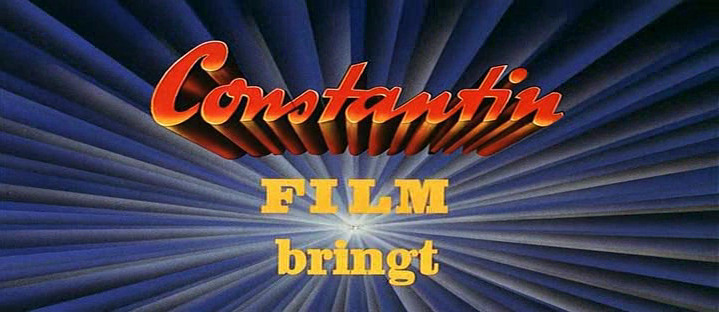
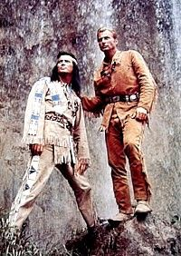
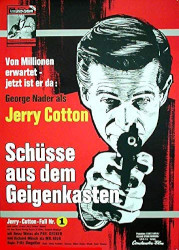
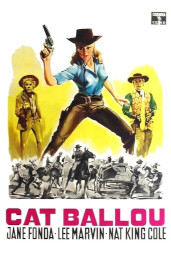
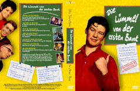

* <a href="https://rainerlueers.github.io/sophies-yard/">Startseite</a>
* <a href="https://rainerlueers.github.io/sophies-yard/unsere_hunde.html">Unsere Hunde</a>
* <a href="https://rainerlueers.github.io/sophies-yard/der_gemuesegarten.html">Der Gemüsegarten</a>
* <a href="https://rainerlueers.github.io/sophies-yard/rainers_software_portfolio.html">Rainer's Software Portfolio</a>
* <a href="https://rainerlueers.github.io/flimmerkiste/">Rainer's Flimmerkiste</a>

---
title: Rainer's Flimmerkiste
---  

# Klassiker des Films

Hier habe ich eine Sammlung von Filmen verlinkt, die ich in meinen frühen Jahren liebend gern gesehen habe, wenn ich durfte ;-)  
Ich schaue auch heute immer mal wieder den ein oder anderen Schinken und komme dabei ins Träumen von der guten alten Zeit...

## Edgar Wallace

### Filme
1. <a href="https://www.dailymotion.com/video/x4snfdf" target="_blank" rel="noopener noreferrer" >Das mysteriöse Schiff (1934)  
1. <a href="https://www.dailymotion.com/video/x4v8d0x" target="_blank" rel="noopener noreferrer" > Der Würger von London (1939)</a>  
1. <a href="https://www.dailymotion.com/video/x4v8ie0" target="_blank" rel="noopener noreferrer" >Die Kammer des Schreckens (1940)</a>  
1. <a href="https://www.dailymotion.com/video/x24cwwi?playlist=x5268c" target="_blank" rel="noopener noreferrer" >Der Würger von London (1940)</a>  
1. <a href="https://www.dailymotion.com/video/x220exm" target="_blank" rel="noopener noreferrer" >Der Frosch mit der Maske (1959)</a>  
1. <a href="https://www.dailymotion.com/video/x220f8o" target="_blank" rel="noopener noreferrer" >Der rote Kreis (1960)</a>  
1. <a href="https://www.dailymotion.com/video/x220f4d" target="_blank" rel="noopener noreferrer" >Der Rächer (1960)</a>  
1. <a href="https://www.dailymotion.com/video/x220fk0" target="_blank" rel="noopener noreferrer" >Die Bande des Schreckens (1960)</a>  
1. <a href="https://www.dailymotion.com/video/x220ezk" target="_blank" rel="noopener noreferrer" >Der grüne Bogenschütze (1961)</a>  
1. <a href="https://www.dailymotion.com/video/x220fpj" target="_blank" rel="noopener noreferrer" >Die toten Augen von London (1961)</a>  
1. <a href="https://www.dailymotion.com/video/x220euo" target="_blank" rel="noopener noreferrer" >Der Fälscher von London (1961)</a>  
1. <a href="https://www.dailymotion.com/video/x220elt" target="_blank" rel="noopener noreferrer" >Das Geheimnis der gelben Narzissen (1961)</a>  
1. <a href="https://www.dailymotion.com/video/x220fmk" target="_blank" rel="noopener noreferrer" >Die seltsame Gräfin (1961)</a>  
1. <a href="https://www.dailymotion.com/video/x220frf?playlist=x3k6cx" target="_blank" rel="noopener noreferrer" >Die Tür mit den 7 Schlössern (1962)</a>  
1. <a href="https://www.dailymotion.com/video/x24cvod" target="_blank" rel="noopener noreferrer" >Das Rätsel der roten Orchidee (1962)</a>  
1. <a href="https://www.dailymotion.com/video/x24cwor?playlist=x5268c" target="_blank" rel="noopener noreferrer" >Der Teppich des Grauens (1962)</a>  
1. <a href="https://www.dailymotion.com/video/x220em4?playlist=x5268c" target="_blank" rel="noopener noreferrer" >Das Gasthaus an der Themse (1962)</a>  
1. Der Fluch der gelben Schlange (1963)  
1. <a href="https://www.dailymotion.com/video/x220fdj?playlist=x5268c" target="_blank" rel="noopener noreferrer" >Der schwarze Abt (1963)</a>  
1. <a href="https://www.dailymotion.com/playlist/x5268c" target="_blank" rel="noopener noreferrer" >Das indische Tuch (1963)</a>  
1. <a href="https://www.dailymotion.com/video/x5le3iq" target="_blank" rel="noopener noreferrer" >Der Zinker (1963) [Teil 1]</a>  
1. <a href="https://www.dailymotion.com/video/x5le3ir" target="_blank" rel="noopener noreferrer" >Der Zinker (1963) [Teil 2]</a>  
1. <a href="https://www.dailymotion.com/video/x24cvgi?playlist=x5268c" target="_blank" rel="noopener noreferrer" >Das Geheimnis der schwarzen Witwe (1963)</a>  
1. <a href="https://www.dailymotion.com/video/x24cxkd?playlist=x5268c" target="_blank" rel="noopener noreferrer" >Die weisse Spinne (1963)</a>  
1. <a href="https://www.dailymotion.com/video/x24cxr0" target="_blank" rel="noopener noreferrer" >Todestrommeln am grossen Fluss (1964)</a>  
1. <a href="https://www.dailymotion.com/video/x24cxsa" target="_blank" rel="noopener noreferrer" >Zimmer 13 (1964)</a>  
1. <a href="https://www.dailymotion.com/video/x24cx6p?playlist=x5268c" target="_blank" rel="noopener noreferrer" >Die Gruft mit dem Rätselschloss (1964)</a>  
1. <a href="https://www.dailymotion.com/video/x24cw4w?playlist=x5268c" target="_blank" rel="noopener noreferrer" >Der Hexer (1964)</a>  
1. <a href="https://www.dailymotion.com/video/x24cvt2" target="_blank" rel="noopener noreferrer" >Das Verrätertor (1964)</a>  
1. <a href="https://www.dailymotion.com/video/x24cxnn" target="_blank" rel="noopener noreferrer" >Sanders und das Schiff des Todes (1964)</a>  
1. <a href="https://www.dailymotion.com/video/x220g1k?playlist=x5268c" target="_blank" rel="noopener noreferrer" >Wartezimmer zum Jenseits (1964)</a>  
1. <a href="https://www.dailymotion.com/video/x220ftp" target="_blank" rel="noopener noreferrer" >Neues vom Hexer (1965)</a>  
1. <a href="https://www.dailymotion.com/video/x220fh2?playlist=x5268c" target="_blank" rel="noopener noreferrer" >Der unheimliche Mönch (1965)</a>  
1. <a href="https://www.dailymotion.com/video/x220eqq" target="_blank" rel="noopener noreferrer" >Das Rätsel des silbernen Dreiecks (1966)</a>  
1. <a href="https://www.dailymotion.com/video/x220eq4?playlist=x5268c" target="_blank" rel="noopener noreferrer" >Das Geheimnis der weissen Nonne (1966)</a>  
1. <a href="https://www.dailymotion.com/video/x220fkx" target="_blank" rel="noopener noreferrer" >Die blaue Hand (1967)</a>  
1. <a href="https://www.dailymotion.com/video/x220f30" target="_blank" rel="noopener noreferrer" >Der Mönch mit der Peitsche (1967)</a>  
1. <a href="https://www.dailymotion.com/video/x220f02" target="_blank" rel="noopener noreferrer" >Der Hund von Blackwood Castle (1968)</a>  
1. <a href="https://www.dailymotion.com/video/x220fsq" target="_blank" rel="noopener noreferrer" >Im Banne des Unheimlichen (1968)</a>  
1. <a href="https://www.dailymotion.com/video/x220ex9" target="_blank" rel="noopener noreferrer" >Der Gorilla von Soho (1968)</a>  
1. <a href="https://www.dailymotion.com/video/x24cw90" target="_blank" rel="noopener noreferrer" >Der Mann mit dem Glasauge (1969)</a>  
1. Das Gesicht im Dunkeln (1969)  
1. Der Teufel kam aus Akasava  
1. <a href="https://www.dailymotion.com/video/x220fno" target="_blank" rel="noopener noreferrer" >Die Tote aus der Themse (1971)</a>  
1. <a href="https://www.dailymotion.com/video/x24cv8a?playlist=x3k6cx" target="_blank" rel="noopener noreferrer" >Das Geheimnis der grünen Stecknadel (1972)</a>  
1. <a href="https://www.dailymotion.com/video/x220erc" target="_blank" rel="noopener noreferrer" >Das Raetsel des silbernen Halbmonds (1972)</a>  

___
## Karl May

### Soundtracks
1. <a href="winnetou_melodie.mp3" target="_blank" rel="noopener noreferrer" >Winnetou-Melodie</a>  
1. <a href="banditen-thema_winnetou3.mp3" target="_blank" rel="noopener noreferrer" >Banditen-Thema - Winnetou 3</a>  
1. <a href="der_schatz_im_silbersee.mp3" target="_blank" rel="noopener noreferrer" >Hauptthema - Der Schatz im Silbersee</a>  
1. <a href="unter_geiern_winnetou_2.mp3" target="_blank" rel="noopener noreferrer" >Hauptthema - Unter Geiern</a>  
1. <a href="im_tal_der_toten.mp3" target="_blank" rel="noopener noreferrer" >Hauptthema - Winnetou und Shatterhand im Tal der Toten</a>  
1. <a href="tramp_melodie_der_schatz_im_silbersee.mp3" target="_blank" rel="noopener noreferrer" >Tramp-Melodie - Der Schatz im Silbersee</a>  
1. <a href="apanatschi.mp3" target="_blank" rel="noopener noreferrer" >Hauptthema - Winnetou und das Halbblut Apanatschi</a>  
1. <a href="ölprinz_melodie.mp3" target="_blank" rel="noopener noreferrer" >Hauptthema - Der Ölprinz</a>  
1. <a href="der_schut.mp3" target="_blank" rel="noopener noreferrer" >Hauptthema - Der Schut</a>  
1. <a href="orchestrion_mason_city_melody.mp3" target="_blank" rel="noopener noreferrer" >Orchestrion - Mason-City-Melody - Old Surehand</a>  

### Filme
1. <a href="https://www.youtube.com/watch?v=72_gRx9Mre8" target="_blank" rel="noopener noreferrer" >Durch die Wüste (1936)</a>  
1. <a href="https://www.dailymotion.com/video/x3y8x40" target="_blank" rel="noopener noreferrer" >Der Schatz im Silbersee (1953)</a>  
1. <a href="https://www.youtube.com/watch?v=Gl9GCBe0dKQ" target="_blank" rel="noopener noreferrer" >Die Sklavenkarawane (1958)</a>  
1. <a href="https://www.youtube.com/watch?v=pEEQQ5_2QPw" target="_blank" rel="noopener noreferrer" >Der Löwe von Babylon (1959)</a>  
1. <a href="https://www.dailymotion.com/video/x220g8t" target="_blank" rel="noopener noreferrer" >Winnetou 1 (1963)</a>  
1. <a href="https://www.dailymotion.com/video/x220g03" target="_blank" rel="noopener noreferrer" >Unter Geiern (1964)</a>  
1. <a href="https://www.dailymotion.com/video/x220g7v" target="_blank" rel="noopener noreferrer" >Winnetou 2 (1964)</a>  
1. <a href="https://www.youtube.com/watch?v=u1xzc4ALfqA" target="_blank" rel="noopener noreferrer" >Old Shatterhand (1964)</a>  
1. <a href="https://www.youtube.com/watch?v=990Swp_F3cE" target="_blank" rel="noopener noreferrer" >Old Surehand (1965)</a>  
1. <a href="https://www.dailymotion.com/video/x220gi6" target="_blank" rel="noopener noreferrer" >Winnetou 3 (1965)</a>  
1. <a href="https://www.dailymotion.com/video/x434lpu" target="_blank" rel="noopener noreferrer" >Der Oelprinz (1965)</a>  
1. <a href="https://www.youtube.com/watch?v=adtjiCcMYrs" target="_blank" rel="noopener noreferrer" >Durchs Wilde Kurdistan (1965)</a>  
1. <a href="https://www.dailymotion.com/video/x434mqa?playlist=x60osg" target="_blank" rel="noopener noreferrer" >Das Vermächtnis des Inka (1965)</a>  
1. <a href="https://hdfilme.cx/filme1/die-pyramide-des-sonnengottes-1965-5051-stream/deutsch" target="_blank" rel="noopener noreferrer" >Die Pyramide des Sonnengottes (1965)</a>  
1. <a href="https://www.dailymotion.com/video/x3y8vqf" target="_blank" rel="noopener noreferrer" >Winnetou und das Halbblut Apanatschi (1966)</a>  
1. <a href="https://www.youtube.com/watch?v=IO3fla6Y1B8&list=PLEgpuXEXTltPjOTFlyiuvjH3_65WbnD4h&index=41" target="_blank" rel="noopener noreferrer" >Winnetou und sein Freund Old Firehand (1966)</a>  

___
## Ennio Morricone

### Filmmusik
1. <a href="Ennio Morricone_The Best of Ennio Morricone_Greatest_Hits.mp3" target="_blank" rel="noopener noreferrer" > The Best of Ennio Morricone - Greatest Hits</a>

___
## Gerd Fröbe

### Filme
1. <a href="https://www.youtube.com/watch?v=m2ZZy3BiLB8" target="_blank" rel="noopener noreferrer" >Nick Knattertons Abenteuer (1959)</a>  
1. <a href="https://www.youtube.com/watch?v=t-nGD5da9og" target="_blank" rel="noopener noreferrer" >Der Gauner und der liebe Gott - Teil 1 (1960)</a>  
1. <a href="https://www.youtube.com/watch?v=a9kiMNZ_ElU&t=0s" target="_blank" rel="noopener noreferrer" >Der Gauner und der liebe Gott - Teil 2 (1960)</a>  
1. <a href="https://www.youtube.com/watch?v=ZHP7bqFV1hA" target="_blank" rel="noopener noreferrer" >Im Stahlnetz des Dr. Mabuse (1961)</a>  
1. <a href="https://www.youtube.com/watch?v=x-kFSCjhAjM" target="_blank" rel="noopener noreferrer" >Der Mann ohne Gesicht - Mister X (1974)</a>  

___
## Heinz Erhardt

### Gesang
1. <a href="https://www.youtube.com/watch?v=_Y_SPAtxX-w" target="_blank" rel="noopener noreferrer" >Agamemnon</a>  
1. <a href="https://www.youtube.com/watch?v=od2glTeVSrE" target="_blank" rel="noopener noreferrer" >Der Muselmann</a>  

### Gedichte
1. <a href="https://www.youtube.com/watch?v=hC6DQIpIsDM" target="_blank" rel="noopener noreferrer" >Wir können das auch lassen...</a>  
1. <a href="https://www.youtube.com/watch?v=fxu82qvMrbU" target="_blank" rel="noopener noreferrer" >Da kommt doch noch was (1957)</a>  
1. <a href="https://www.youtube.com/watch?v=6n5y8_ehpNo" target="_blank" rel="noopener noreferrer" >Der Hund</a>  
1. <a href="https://www.youtube.com/watch?v=mf-iIyELIQ4" target="_blank" rel="noopener noreferrer" >Columbus</a>  
1. <a href="https://www.youtube.com/watch?v=EUJMt4gsbk0" target="_blank" rel="noopener noreferrer" > Vierzeiler</a>  
1. <a href="https://www.youtube.com/watch?v=1BD1LPYwANU" target="_blank" rel="noopener noreferrer" >Die Maurizius</a>  
1. <a href="https://www.youtube.com/watch?v=qfSzyScYJ20" target="_blank" rel="noopener noreferrer" >Das Gewitter 2</a>  
1. <a href="https://www.youtube.com/watch?v=HkYDH1X818M" target="_blank" rel="noopener noreferrer" >Das Nasshorn</a>  
1. <a href="https://www.youtube.com/watch?v=LvwenjxiXLE" target="_blank" rel="noopener noreferrer" >Der Stier</a>  
1. <a href="https://www.youtube.com/watch?v=V9Q4rSJU2QQ" target="_blank" rel="noopener noreferrer" >Kunibert</a>  
1. <a href="https://www.youtube.com/watch?v=HyBZYo3C8TQ" target="_blank" rel="noopener noreferrer" >Das Ei des Kolumbus</a>  
1. <a href="https://www.youtube.com/watch?v=qTEjQB6fav8" target="_blank" rel="noopener noreferrer" >Goethe und die Fliege</a>  
1. <a href="https://www.youtube.com/watch?v=VnKPybfZwi0" target="_blank" rel="noopener noreferrer" >Das Unwetter</a>  
1. <a href="https://www.youtube.com/watch?v=7yeARmsv2Eo" target="_blank" rel="noopener noreferrer" >Das Gewitter</a>  
1. <a href="https://www.youtube.com/watch?v=ojA0NAjLQt0" target="_blank" rel="noopener noreferrer" >Die Made</a>  
1. <a href="https://www.youtube.com/watch?v=jmkHaFweba8" target="_blank" rel="noopener noreferrer" >König Erl</a>  
1. <a href="https://www.youtube.com/watch?v=NQO1rGM3Flg" target="_blank" rel="noopener noreferrer" >Die Polyglotte Katzen</a>  
1. <a href="https://www.youtube.com/watch?v=BNMNQGj60u8" target="_blank" rel="noopener noreferrer" >Das alte Schloß</a>  
1. <a href="https://www.youtube.com/watch?v=3ge0Wrf-cfI&list=PLE4A40E0EFC6B885B" target="_blank" rel="noopener noreferrer" >Der Berg</a>  
1. <a href="https://www.youtube.com/watch?v=i8X1sjHBoRU&list=PLE4A40E0EFC6B885B&index=2" target="_blank" rel="noopener noreferrer" >Ritter Fips...</a>  
1. <a href="https://www.youtube.com/watch?v=iUG-XcL0Pxc&list=PLE4A40E0EFC6B885B&index=13" target="_blank" rel="noopener noreferrer" >Das Pechmariechen</a>  
1. <a href="https://www.youtube.com/watch?v=m8RnsGHAYG0&list=PLE4A40E0EFC6B885B&index=15" target="_blank" rel="noopener noreferrer" >Der Tauchenichts</a>  
1. <a href="https://www.youtube.com/watch?v=iW5YdBbofLw&list=PLE4A40E0EFC6B885B&index=22" target="_blank" rel="noopener noreferrer" >Urlaub</a>  

### Filme
1. <a href="https://adult.noodlemagazine.com/watch/-80199384_456239770" target="_blank" rel="noopener noreferrer" >Gesucht wird Majora (1949)</a>  
1. <a href="https://adult.noodlemagazine.com/watch/-80199384_456239315" target="_blank" rel="noopener noreferrer" >Liebe auf Eis (1950)</a>  
1. Drei Tage Mittelarrest (1955)  
1. <a href="https://www.youtube.com/watch?v=D4nO54FkGWI" target="_blank" rel="noopener noreferrer" >Ich und meine Schwiegersöhne (1956)</a>  
1. <a href="https://www.youtube.com/watch?v=tBRez0GXoH4" target="_blank" rel="noopener noreferrer" >Die gestohlene Hose (1956)</a>  
1. <a href="https://www.dailymotion.com/video/x21d0ft" target="_blank" rel="noopener noreferrer" >Mädchen mit schwachem Gedächtnis (1956)</a>  
1. <a href="https://adult.noodlemagazine.com/watch/-80199384_456239681" target="_blank" rel="noopener noreferrer" >II-A in Berlin (1956)</a>  
1. <a href="https://adult.noodlemagazine.com/watch/-80199384_456239980" target="_blank" rel="noopener noreferrer" >Der müde Theodor (1957)</a>
1. <a href="https://www.dailymotion.com/video/x21bumm" target="_blank" rel="noopener noreferrer" >Witwer mit fünf Töchtern (1957)</a>  
1. <a href="https://www.dailymotion.com/video/x20ilih" target="_blank" rel="noopener noreferrer" >Immer die Radfahrer (1958)</a>  
1. <a href="https://www.dailymotion.com/video/x21d40g" target="_blank" rel="noopener noreferrer" >So ein Millionär hats schwer (1958)</a>  
1. <a href="https://www.dailymotion.com/video/x21ciqm" target="_blank" rel="noopener noreferrer" >Vater Mutter und neun Kinder (1958)</a>  
1. <a href="https://www.dailymotion.com/video/x20pnei" target="_blank" rel="noopener noreferrer" >Der Haustyrann (1959)</a>  
1. <a href="https://www.dailymotion.com/video/x20q2ks" target="_blank" rel="noopener noreferrer" >Natürlich die Autofahrer (1959)</a>  
1. <a href="https://www.dailymotion.com/video/x20pzpk" target="_blank" rel="noopener noreferrer" >Drillinge an Bord (1959)</a>  
1. <a href="https://www.dailymotion.com/video/x20m7si" target="_blank" rel="noopener noreferrer" >Der letzte Fussgänger (1960)</a>  
1. <a href="https://www.dailymotion.com/video/x20pegm" target="_blank" rel="noopener noreferrer" >Kauf Dir einen bunten Luftballon (1961)</a>  
1. <a href="https://www.dailymotion.com/video/x21dazu" target="_blank" rel="noopener noreferrer" >Mein Mann das Wirtschaftswunder (1961)</a>  
1. <a href="https://www.dailymotion.com/video/x20pfkj" target="_blank" rel="noopener noreferrer" >Ach Egon! (1961)</a>  
1. <a href="https://www.dailymotion.com/video/x20ik3y" target="_blank" rel="noopener noreferrer" >Drei Mann in einem Boot (1961)</a>  
1. <a href="https://www.dailymotion.com/video/x42k3et" target="_blank" rel="noopener noreferrer" >Freddy und der Millionär (1961)</a>  
1. <a href="https://www.dailymotion.com/video/x20pmdm" target="_blank" rel="noopener noreferrer" >Die Post geht ab (1962)</a>  
1. Axel Munthe – Der Arzt von San Michele (1962)  
1. Ohne Krimi geht die Mimi nie ins Bett (1962)  
1. <a href="https://www.dailymotion.com/video/x20pgky" target="_blank" rel="noopener noreferrer" >Apartmentzauber (1963)</a>  
1. <a href="https://www.dailymotion.com/video/x21c3ra" target="_blank" rel="noopener noreferrer" >Wenn man baden geht auf Teneriffa (1964)</a>  
1. <a href="https://www.dailymotion.com/video/x22eshu" target="_blank" rel="noopener noreferrer" >Die große Kür (1964)</a>  
1. <a href="https://www.dailymotion.com/video/x41axod" target="_blank" rel="noopener noreferrer" >Das Gewisse etwas der Frauen (1966)</a>  
1. <a href="https://www.youtube.com/watch?v=9BQpVxO1mJg" target="_blank" rel="noopener noreferrer" >Otto ist auf Frauen scharf 1968</a>  
1. Charley’s Onkel (1969)  
1. <a href="https://www.dailymotion.com/video/x43h95k" target="_blank" rel="noopener noreferrer" >Warum hab Ich bloss 2x Ja gesagt (1969)</a>  
1. <a href="https://www.dailymotion.com/video/x4202kd" target="_blank" rel="noopener noreferrer" >Klein Erna auf dem Jungfernstieg (1969)</a>  
1. <a href="https://www.dailymotion.com/video/x41pneq" target="_blank" rel="noopener noreferrer" >Die Herren mit der weissen Weste (1969)</a>  
1. <a href="https://www.dailymotion.com/video/x21cuzx" target="_blank" rel="noopener noreferrer" >Was ist denn bloss mit Willi los (1970)</a>  
1. <a href="https://www.dailymotion.com/video/x20pxo3" target="_blank" rel="noopener noreferrer" >Das kann doch unseren Willi nicht erschuettern (1970)</a>  
1. <a href="https://www.dailymotion.com/video/x20prg8" target="_blank" rel="noopener noreferrer" >Unser Willi ist der Beste (1971)</a>
1. <a href="https://www.dailymotion.com/video/x21cjyu?playlist=x5m3m6" target="_blank" rel="noopener noreferrer" >Willi wird das Kind schon schaukeln (1972)</a>  
1. Noch ’ne Oper (1979)  

___
## Jerry Cotton

### Filme
1. <a href="https://www.youtube.com/watch?v=JnVqRGl9rDA" target="_blank" rel="noopener noreferrer" >Schüsse aus dem Geigenkasten (1965)</a>  
1. <a href="https://www.youtube.com/watch?v=rrA5YiRUKOU" target="_blank" rel="noopener noreferrer" >Mordnacht in Manhattan (1965)</a>  
1. <a href="https://www.youtube.com/watch?v=aELVUQdH4Vg&list=PL7VQeYm-UVvEyk2IihN7_q7eQz7b3UhHt&index=3" target="_blank" rel="noopener noreferrer" >Um Null Uhr schnappt die Falle zu (1966)</a>  
1. <a href="https://www.youtube.com/watch?v=qsRufewj3R8&list=PL7VQeYm-UVvEyk2IihN7_q7eQz7b3UhHt&index=4" target="_blank" rel="noopener noreferrer" >Die Rechnung eiskalt serviert (1966)</a>  
1. <a href="https://www.youtube.com/watch?v=o96BZz2dno0&list=PL7VQeYm-UVvEyk2IihN7_q7eQz7b3UhHt&index=5" target="_blank" rel="noopener noreferrer" >Der Mörderclub von Brooklyn (1967)</a>  
1. <a href="https://www.youtube.com/watch?v=E7PblJkQk-4&list=PL7VQeYm-UVvEyk2IihN7_q7eQz7b3UhHt&index=6" target="_blank" rel="noopener noreferrer" >Dynamit in grüner Seide (1968)</a>  
1. Der Tod im roten Jaguar (1968)  
1. Todesschüsse am Broadway (1969)  

___
## DuDu

### Filme

1. <a href="https://www.youtube.com/watch?v=iqH8J8yN78s" target="_blank" rel="noopener noreferrer" >Ein Käfer geht aufs Ganze (1971)</a>  
1. <a href="https://www.dailymotion.com/video/x41avqj" target="_blank" rel="noopener noreferrer" >Ein Käfer gibt Vollgas (1972)</a>  
1. <a href="https://www.youtube.com/watch?v=dT9skf4-k-s" target="_blank" rel="noopener noreferrer" >Ein Käfer auf Extratour (1973)</a>  
1. <a href="https://www.dailymotion.com/video/x420277" target="_blank" rel="noopener noreferrer" >Das verrückteste Auto der Welt (1975)</a>  
1. <a href="https://www.dailymotion.com/video/x42k3f9" target="_blank" rel="noopener noreferrer" >Zwei tolle Käfer räumen auf (1978)</a>  

___
## Zorro

### Filme
1. <a href="https://www.youtube.com/watch?v=9HwlakD4Y_M" target="_blank" rel="noopener noreferrer" >Zorro - Der blutrote Adler (1936)</a>  
1. <a href="https://www.youtube.com/watch?v=qKyBclk_N5E" target="_blank" rel="noopener noreferrer" >Zorro im wilden Westen (1949)</a>  
1. <a href="https://www.youtube.com/watch?v=GTd8u91gzg8" target="_blank" rel="noopener noreferrer" >Zorros Heimkehr und Rache (1962)</a>  
1. <a href="https://www.youtube.com/watch?v=eEvhxrsBLT8&list=PLr9nhEFUrhD87f0ciIQkAYgr_fdjlIpVw&index=33" target="_blank" rel="noopener noreferrer" >Auf Zorros Spuren (1963)</a>  

___
## Cat Ballou

### Film
1. <a href="https://xcine.me/filme-cat-ballou-hngen-sollst-du-in-wyoming-1965-5217-stream/deutsch" target="_blank" rel="noopener noreferrer" >Cat Ballou - Hängen sollst du in Wyoming (1965)</a>  

___
## Kommissar Maigret

### Filme
1. <a href="https://www.dailymotion.com/video/x802ovc" target="_blank" rel="noopener noreferrer" >Maigret und die Tänzerin Arlette (1960)</a>  
1. <a href="https://www.dailymotion.com/video/x8038ww" target="_blank" rel="noopener noreferrer" >Maigret hat Skrupel (1960)</a>  
1. <a href="https://www.dailymotion.com/video/x805jbb?playlist=x721cq" target="_blank" rel="noopener noreferrer" >Maigret und die Bohnenstange (1960)</a>  
1. <a href="https://www.dailymotion.com/video/x805jpj?playlist=x721cq" target="_blank" rel="noopener noreferrer" >Maigret und sein Revolver (1960)</a>  
1. <a href="https://www.dailymotion.com/video/x806do7?playlist=x721cq" target="_blank" rel="noopener noreferrer" >Maigret und die alte Dame (1960)</a>  
1. <a href="https://www.dailymotion.com/video/x806dvm?playlist=x721cq" target="_blank" rel="noopener noreferrer" >Maigret in der Liberty Bar (1960)</a>  
1. <a href="https://www.dailymotion.com/video/x8088o6?playlist=x721cq" target="_blank" rel="noopener noreferrer" >Maigret und der tote Herr Gallet (1960)</a>  
1. <a href="https://www.dailymotion.com/video/x808qgy?playlist=x721cq" target="_blank" rel="noopener noreferrer" >Mein Freund Maigret (1960)</a>  
1. <a href="https://www.dailymotion.com/video/x808ql9?playlist=x721cq" target="_blank" rel="noopener noreferrer" >Hier irrt Maigret (1960)</a>  
1. <a href="https://www.dailymotion.com/video/x80a2nj?playlist=x721cq" target="_blank" rel="noopener noreferrer" >Maigret nimmt Urlaub (1961)</a>  
1. <a href="https://www.dailymotion.com/video/x80ckiv?playlist=x721cq" target="_blank" rel="noopener noreferrer" >Maigret und die Gangster (1961)</a>  
1. <a href="https://www.dailymotion.com/video/x80dshn?playlist=x721cq" target="_blank" rel="noopener noreferrer" >Maigret als möblierter Herr (1961)</a>  
1. <a href="https://www.dailymotion.com/video/x80dtgj?playlist=x721cq" target="_blank" rel="noopener noreferrer" >Maigret und die Anarchisten (1961)</a>  
1. <a href="https://www.dailymotion.com/video/x80dtoc?playlist=x721cq" target="_blank" rel="noopener noreferrer" >Maigret und der Schatten am Fenster (1961)</a>  
1. <a href="https://www.dailymotion.com/video/x80egcm?playlist=x721cq" target="_blank" rel="noopener noreferrer" >Maigret und der Kopflose (1961)</a>  
1. <a href="https://www.dailymotion.com/video/x80f6ei?playlist=x721cq" target="_blank" rel="noopener noreferrer" >Maigret trifft einen Schulfreund (1961)</a>  
1. <a href="https://www.dailymotion.com/video/x80iedg?playlist=x721cq" target="_blank" rel="noopener noreferrer" >Maigret und sein Toter (1961)</a>  
1. <a href="https://www.dailymotion.com/video/x80if7j?playlist=x721cq" target="_blank" rel="noopener noreferrer" >Maigret und Inspektor Lognons Triumph (1961)</a>  
1. <a href="https://www.dailymotion.com/video/x80kdnu?playlist=x721cq" target="_blank" rel="noopener noreferrer" >Maigret und der geheimnisvolle Kapitän (1961)</a>  
1. <a href="https://www.dailymotion.com/video/x80kec4?playlist=x721cq" target="_blank" rel="noopener noreferrer" >Maigret und die Kanalratten (1961)</a>  
1. <a href="https://www.dailymotion.com/video/x80m0on?playlist=x721cq" target="_blank" rel="noopener noreferrer" >Maigret vor dem Schwurgericht (1961)</a>  
1. <a href="https://www.dailymotion.com/video/x80mz3j?playlist=x721cq" target="_blank" rel="noopener noreferrer" >Maigret und die schrecklichen Kinder (1961)</a>  
1. <a href="https://www.dailymotion.com/video/x80mzc9?playlist=x721cq" target="_blank" rel="noopener noreferrer" >Maigret und der Weihnachtsmann (1961)</a>  
1. <a href="https://www.dailymotion.com/video/x80nveh?playlist=x721cq" target="_blank" rel="noopener noreferrer" >Maigret und die widerspenstigen Zeugen (1962)</a>  
1. <a href="https://www.dailymotion.com/video/x80nvug?playlist=x721cq" target="_blank" rel="noopener noreferrer" >Frau Maigret als Detektiv (1962)</a>  
1. <a href="https://www.dailymotion.com/video/x80ome6?playlist=x721cq" target="_blank" rel="noopener noreferrer" >Maigret und der Mann auf der Bank (1962)</a>  
1. <a href="https://www.dailymotion.com/video/x80p5nz?playlist=x721cq" target="_blank" rel="noopener noreferrer" >Maigret und die Adligen (1962)</a>  
1. <a href="https://www.dailymotion.com/video/x80qlq8?playlist=x721cq" target="_blank" rel="noopener noreferrer" >Maigret und der Verrückte (1962)</a>  
1. <a href="https://www.dailymotion.com/video/x80qlws?playlist=x721cq" target="_blank" rel="noopener noreferrer" >Maigret und das Geheimnis im Schloss (1962)</a>  
1. <a href="https://www.dailymotion.com/video/x80qm8z?playlist=x721cq" target="_blank" rel="noopener noreferrer" >Maigret und die Groschenschenke (1962)</a>  
1. <a href="https://www.dailymotion.com/video/x80s8rr?playlist=x721cq" target="_blank" rel="noopener noreferrer" >Maigret hilft einem Dienstmädchen (1962)</a>  
1. <a href="https://www.dailymotion.com/video/x80s95m?playlist=x721cq" target="_blank" rel="noopener noreferrer" >Maigret ist wütend (1962)</a>  
1. <a href="https://www.dailymotion.com/video/x80s9ii?playlist=x721cq" target="_blank" rel="noopener noreferrer" >Maigret und die Wahrsagerin (1962)</a>  
1. <a href="https://www.dailymotion.com/video/x80tdxa?playlist=x721cq" target="_blank" rel="noopener noreferrer" >Maigret riskiert seine Stellung (1962)</a>  
1. <a href="https://www.dailymotion.com/video/x80teds?playlist=x721cq" target="_blank" rel="noopener noreferrer" >Maigret und der faule Dieb (1962)</a>  
1. <a href="https://www.dailymotion.com/video/x80tf5s?playlist=x721cq" target="_blank" rel="noopener noreferrer" >Maigret verliert eine Verehrerin (1963)</a>  
1. <a href="https://www.dailymotion.com/video/x80uci7?playlist=x721cq" target="_blank" rel="noopener noreferrer" >Maigret hat Angst (1963)</a>  
1. <a href="https://www.dailymotion.com/video/x80ucrl?playlist=x721cq" target="_blank" rel="noopener noreferrer" >Maigret und der Fall Josset (1963)</a>  
1. <a href="https://www.dailymotion.com/video/x80v0u2?playlist=x721cq" target="_blank" rel="noopener noreferrer" >Maigret bei den Flamen (1963)</a>  
1. <a href="https://www.dailymotion.com/video/x80v0zp?playlist=x721cq" target="_blank" rel="noopener noreferrer" >Maigret gibt Lapointe eine Chance (1963)</a>  
1. <a href="https://www.dailymotion.com/video/x80vpx9?playlist=x721cq" target="_blank" rel="noopener noreferrer" >Maigret und das Verbrechen an Bord (1963)</a>  
1. <a href="https://www.dailymotion.com/video/x80vq5d?playlist=x721cq" target="_blank" rel="noopener noreferrer" >Maigret und das Haus des Richters (1963)</a>  
1. <a href="https://www.dailymotion.com/video/x80wl3x?playlist=x721cq" target="_blank" rel="noopener noreferrer" >Maigret auf Reisen (1963)</a>  
1. <a href="https://www.dailymotion.com/video/x80wljt?playlist=x721cq" target="_blank" rel="noopener noreferrer" >Maigret und die seltsame Leiche (1963)</a>  
1. <a href="https://www.dailymotion.com/video/x80xn5v?playlist=x721cq" target="_blank" rel="noopener noreferrer" >Maigret und die Zwillinge (1963)</a>  
1. <a href="https://www.dailymotion.com/video/x80zjj0?playlist=x721cq" target="_blank" rel="noopener noreferrer" >Maigret als Zuschauer (1963)</a>  
1. <a href="https://www.dailymotion.com/video/x54z60a" target="_blank" rel="noopener noreferrer" >Maigret und sein größter Fall (1966)</a>  

## Dr. Richard Kimble - Auf der Flucht 

* Erscheinungsjahr: 1963–1967  
* Von 120 Episoden wurden 74 in Deutschland ausgestrahlt  
* Erstausstrahlung 17. September 1963 (USA) auf ABC  
* Deutschsprachige Erstausstrahlung 9. Juli 1965 ARD  

### Episoden
1. <a href="https://www.dailymotion.com/video/x80ego3?playlist=x72k2j" target="_blank" rel="noopener noreferrer" >Eingekreist</a>  
1. <a href="https://www.dailymotion.com/video/x80egu0?playlist=x72k2j" target="_blank" rel="noopener noreferrer" >Der mysteriöse Fremde</a>  
1. <a href="https://www.dailymotion.com/video/x80f6nh?playlist=x72k2j" target="_blank" rel="noopener noreferrer" >Hollywood sehen und sterben</a>  
1. <a href="https://www.dailymotion.com/video/x80f710?playlist=x72k2j" target="_blank" rel="noopener noreferrer" >Kurs auf Alaska</a>  
1. <a href="https://www.dailymotion.com/video/x80glrh?playlist=x72k2j" target="_blank" rel="noopener noreferrer" >Albträume</a>  
1. <a href="https://www.dailymotion.com/video/x80hipf?playlist=x72k2j" target="_blank" rel="noopener noreferrer" >Eine Frau ohne Skrupel</a>  
1. <a href="https://www.dailymotion.com/video/x80hj3y?playlist=x72k2j" target="_blank" rel="noopener noreferrer" >Unter rauhen Männern</a>  
1. <a href="https://www.dailymotion.com/video/x80jqms?playlist=x72k2j" target="_blank" rel="noopener noreferrer" >Allein in einer fremden Stadt</a>  
1. <a href="https://www.dailymotion.com/video/x80jqps?playlist=x72k2j" target="_blank" rel="noopener noreferrer" >Gefährliche Heimkehr</a>  
1. <a href="https://www.dailymotion.com/video/x80m0yl?playlist=x72k2j" target="_blank" rel="noopener noreferrer" >Eine tödliche Verwechslung</a>  
1. <a href="https://www.dailymotion.com/video/x80m168?playlist=x72k2j" target="_blank" rel="noopener noreferrer" >Zwischenfall in Black Moccasin</a>  
1. <a href="https://www.dailymotion.com/video/x80myv7?playlist=x72k2j" target="_blank" rel="noopener noreferrer" >Die Bank gewinnt immer</a>  
1. <a href="https://www.dailymotion.com/video/x80nurr?playlist=x72k2j" target="_blank" rel="noopener noreferrer" >Die Spur führt nach Chicago</a>  
1. <a href="https://www.dailymotion.com/video/x80prrn?playlist=x72k2j" target="_blank" rel="noopener noreferrer" >Die Ratte</a>  
1. <a href="https://www.dailymotion.com/video/x80prvz?playlist=x72k2j" target="_blank" rel="noopener noreferrer" >Der Schutzengel</a>  
1. <a href="https://www.dailymotion.com/video/x80ps3f?playlist=x72k2j" target="_blank" rel="noopener noreferrer" >Engel reisen auf einsamen Straßen</a>  
1. <a href="https://www.dailymotion.com/video/x80zk63?playlist=x72k2j" target="_blank" rel="noopener noreferrer" >Ein Mann sucht seinen Richter</a>  
1. <a href="https://www.dailymotion.com/video/x811jex?playlist=x72k2j" target="_blank" rel="noopener noreferrer" >Gefährliches Rezept</a>  
1. <a href="https://www.dailymotion.com/video/x811jlg?playlist=x72k2j" target="_blank" rel="noopener noreferrer" >Richter in eigener Sache</a>  
1. <a href="https://www.dailymotion.com/video/x812ik7?playlist=x72k2j" target="_blank" rel="noopener noreferrer" >Am Ende der Welt</a>  
1. <a href="https://www.dailymotion.com/video/x812ivc?playlist=x72k2j" target="_blank" rel="noopener noreferrer" >Zeuge wider Willen</a>  
1. <a href="https://www.dailymotion.com/video/x813esv?playlist=x72k2j" target="_blank" rel="noopener noreferrer" >Kleine Fische</a>  
1. <a href="https://www.dailymotion.com/video/x813fan?playlist=x72k2j" target="_blank" rel="noopener noreferrer" >Eine falsche Geisel</a>  
1. <a href="https://www.dailymotion.com/video/x8147yc?playlist=x72k2j" target="_blank" rel="noopener noreferrer" >Auch ein Sheriff macht Fehler</a>  
1. <a href="https://www.dailymotion.com/video/x81480n?playlist=x72k2j" target="_blank" rel="noopener noreferrer" >Der Lebensretter der eisernen Lady</a>  
1. <a href="https://www.dailymotion.com/video/x815kt1?playlist=x72k2j" target="_blank" rel="noopener noreferrer" >Des Teufels Karneval</a>  
1. <a href="https://www.dailymotion.com/video/x816llf?playlist=x72k2j" target="_blank" rel="noopener noreferrer" >Rendezvous mit dem Tod</a>  
1. <a href="https://www.dailymotion.com/video/x816lnv?playlist=x72k2j" target="_blank" rel="noopener noreferrer" >Wolf im Schafspelz</a>  
1. <a href="https://www.dailymotion.com/video/x818ibu?playlist=x72k2j" target="_blank" rel="noopener noreferrer" >Die Augenzeugen</a>  
1. <a href="https://www.dailymotion.com/video/x818ie8?playlist=x72k2j" target="_blank" rel="noopener noreferrer" >Lynchjustiz</a>  
1. <a href="https://www.dailymotion.com/video/x8198tl?playlist=x72k2j" target="_blank" rel="noopener noreferrer" >Im Schatten einer Toten</a>  
1. <a href="https://www.dailymotion.com/video/x81ay4x?playlist=x72k2j" target="_blank" rel="noopener noreferrer" >Nur ein Versicherungsbetrug ?</a>  
1. <a href="https://www.dailymotion.com/video/x81ceth?playlist=x72k2j" target="_blank" rel="noopener noreferrer" >Ein falsches Geständnis</a>  
1. <a href="https://www.dailymotion.com/video/x81cex3?playlist=x72k2j" target="_blank" rel="noopener noreferrer" >Gefährliche Gäste</a>  
1. <a href="https://www.dailymotion.com/video/x81dbwd?playlist=x72k2j" target="_blank" rel="noopener noreferrer" >Zwangspause</a>  
1. <a href="https://www.dailymotion.com/video/x81dc05?playlist=x72k2j" target="_blank" rel="noopener noreferrer" >Endlich eine Spur</a>  
1. <a href="https://www.dailymotion.com/video/x81dc3p?playlist=x72k2j" target="_blank" rel="noopener noreferrer" >Streng geheim - Giftgas</a>  
1. <a href="https://www.dailymotion.com/video/x81eprf?playlist=x72k2j" target="_blank" rel="noopener noreferrer" >Einen Strohmann verbrennen</a>  
1. <a href="https://www.dailymotion.com/video/x81g8rs?playlist=x72k2j" target="_blank" rel="noopener noreferrer" >Jagd nach dem Einarmigen</a>  
1. <a href="https://www.dailymotion.com/video/x81g8x4?playlist=x72k2j" target="_blank" rel="noopener noreferrer" >Schmutzige Wäsche</a>  
1. <a href="https://www.dailymotion.com/video/x81gv94?playlist=x72k2j" target="_blank" rel="noopener noreferrer" >Ein tödlicher Unfall</a>  
1. <a href="https://www.dailymotion.com/video/x81hjuf?playlist=x72k2j" target="_blank" rel="noopener noreferrer" >Ein sicheres Versteck</a>  
1. <a href="https://www.dailymotion.com/video/x81imlj?playlist=x72k2j" target="_blank" rel="noopener noreferrer" >Chinese Sunset</a>  
1. <a href="https://www.dailymotion.com/video/x81imot?playlist=x72k2j" target="_blank" rel="noopener noreferrer" >Ein Computer jagt Richard Kimble</a>  
1. <a href="https://www.dailymotion.com/video/x81kabe?playlist=x72k2j" target="_blank" rel="noopener noreferrer" >Durch die Wüste</a>  
1. <a href="https://www.dailymotion.com/video/x81kagh?playlist=x72k2j" target="_blank" rel="noopener noreferrer" >Unfreiwilliger Augenzeuge</a>  
1. <a href="https://www.dailymotion.com/video/x81llg4?playlist=x72k2j" target="_blank" rel="noopener noreferrer" >Ein wertloses Versprechen</a>  
1. <a href="https://www.dailymotion.com/video/x81lljz?playlist=x72k2j" target="_blank" rel="noopener noreferrer" >Blaues Blut</a>  
1. <a href="https://www.dailymotion.com/video/x81llmp?playlist=x72k2j" target="_blank" rel="noopener noreferrer" > Belohnung: 10.000 Dollar</a>  
1. <a href="https://www.dailymotion.com/video/x81mosb?playlist=x72k2j" target="_blank" rel="noopener noreferrer" >In Joshuas Königreich</a>  
1. <a href="https://www.dailymotion.com/video/x81mov2?playlist=x72k2j" target="_blank" rel="noopener noreferrer" >Dem Einarmigen auf der Spur</a>  
1. <a href="https://www.dailymotion.com/video/x81olwr?playlist=x72k2j" target="_blank" rel="noopener noreferrer" >Kalifornischer Wein hat es in sich</a>  
1. <a href="https://www.dailymotion.com/video/x81oma4?playlist=x72k2j" target="_blank" rel="noopener noreferrer" >Anders als andere</a>  
1. <a href="https://www.dailymotion.com/video/x81omgy?playlist=x72k2j" target="_blank" rel="noopener noreferrer" >Keiner verliert immer</a>  
1. <a href="https://www.dailymotion.com/video/x81qjuj?playlist=x72k2j" target="_blank" rel="noopener noreferrer" >Letzter Ausweg Mexico</a>  
1. <a href="https://www.dailymotion.com/video/x81qjwg?playlist=x72k2j" target="_blank" rel="noopener noreferrer" >Die Jünger des Teufels</a>  
1. <a href="https://www.dailymotion.com/video/x81qjyt?playlist=x72k2j" target="_blank" rel="noopener noreferrer" >Notoperation im letzten Moment</a>  
1. <a href="https://www.dailymotion.com/video/x81sxhd?playlist=x72k2j" target="_blank" rel="noopener noreferrer" >Das Böse, das Männer tun</a>  
1. <a href="https://www.dailymotion.com/video/x81syig?playlist=x72k2j" target="_blank" rel="noopener noreferrer" >Von der Außenwelt abgeschnitten</a>  
1. <a href="https://www.dailymotion.com/video/x81syag?playlist=x72k2j" target="_blank" rel="noopener noreferrer" >Alles hat seine zwei Seiten</a>  
1. <a href="https://www.dailymotion.com/video/x81uaow?playlist=x72k2j" target="_blank" rel="noopener noreferrer" >Fluchtpunkt Mexiko</a>  
1. <a href="https://www.dailymotion.com/video/x81uasy?playlist=x72k2j" target="_blank" rel="noopener noreferrer" >Erdrückende Beweise</a>  
1. <a href="https://www.dailymotion.com/video/x81w1xh?playlist=x72k2j" target="_blank" rel="noopener noreferrer" >Die Angst zu versagen</a>  
1. <a href="https://www.dailymotion.com/video/x81w20c?playlist=x72k2j" target="_blank" rel="noopener noreferrer" >Kidnapping</a>  
1. <a href="https://www.dailymotion.com/video/x81ws2p?playlist=x72k2j" target="_blank" rel="noopener noreferrer" >Im Labyrinth der Träume</a>  
1. <a href="https://www.dailymotion.com/video/x81wrvt?playlist=x72k2j" target="_blank" rel="noopener noreferrer" >Ein hinterhältiger Mordanschlag</a>  
1. <a href="https://www.dailymotion.com/video/x81xz60?playlist=x72k2j" target="_blank" rel="noopener noreferrer" >Auf dem Weg zur Todeszelle</a>  
1. <a href="https://www.dailymotion.com/video/x81xz7t?playlist=x72k2j" target="_blank" rel="noopener noreferrer" >Das Gesetz der Straße</a>  
1. <a href="https://www.dailymotion.com/video/x81xz9g?playlist=x72k2j" target="_blank" rel="noopener noreferrer" >Ein aussichtsloser Kampf</a>  
1. <a href="https://www.dailymotion.com/video/x81yr7o?playlist=x72k2j" target="_blank" rel="noopener noreferrer" >Flucht in die Botschaft</a>  
1. <a href="https://www.dailymotion.com/video/x81yra4?playlist=x72k2j" target="_blank" rel="noopener noreferrer" >Komm mit nach Kanada</a>  
1. <a href="https://www.dailymotion.com/video/x81yrdb?playlist=x72k2j" target="_blank" rel="noopener noreferrer" >Tödliches Schweigen</a>  
1. <a href="https://www.dailymotion.com/video/x820fwc?playlist=x72k2j" target="_blank" rel="noopener noreferrer" >Dr. Kimble, sie sind verhaftet</a>  
1. <a href="https://www.dailymotion.com/video/x820fz8?playlist=x72k2j" target="_blank" rel="noopener noreferrer" >Das Urteil</a>  

___
## Die Lümmel sind los!

### Filme
1. <a href="https://www.dailymotion.com/video/x28gmih" target="_blank" rel="noopener noreferrer" >Zur Hölle mit den Paukern (1967)</a>  
1. <a href="https://www.dailymotion.com/video/x28gmii" target="_blank" rel="noopener noreferrer" >Zum Teufel mit der Penne (1968)</a>  
1. <a href="https://www.dailymotion.com/video/x28gme7" target="_blank" rel="noopener noreferrer" >Pepe der Paukerschreck (1969)</a>  
1. <a href="https://www.dailymotion.com/video/x28gmax" target="_blank" rel="noopener noreferrer" >Hurra die Schule brennt (1969)</a>  
1. <a href="https://www.dailymotion.com/video/x28gmet" target="_blank" rel="noopener noreferrer" >Wir haun die Lehrer in die Pfanne (1970)</a>  
1. <a href="https://www.dailymotion.com/video/x28gmbv" target="_blank" rel="noopener noreferrer" >Morgen fällt die Schule aus (1971)</a>  
1. <a href="https://www.dailymotion.com/video/x28gman" target="_blank" rel="noopener noreferrer" >Betragen ungenügend (1972)</a>  

